# CGRA 2020/2021

## Group T07G04
| Name                        | Number    | E-Mail                              |
| --------------------------- | --------- | ----------------------------------- |
| Francisco Cerqueira         | 201905337 | up201905337@fe.up.pt                |
| Vasco Alves                 | 201808031 | up201808031@fe.up.pt                |

----

## Project Notes

- Optamos por implementar os pontos 7.1, 7.3, 7.4 e 7.6 e pretendemos que sejam estes os avaliados.
- Achamos importante destacar os seguintes aspetos:
    - Melhoramos as barbatanas para que, após a rotação do peixe, retomem a animação quando se encontrarem na mesma posição que a do lado oposto.
    - Adicionamos rotação ao lançamento da pedra para dar um efeito mais natural.

## Screenshots

### 1 - MyFish

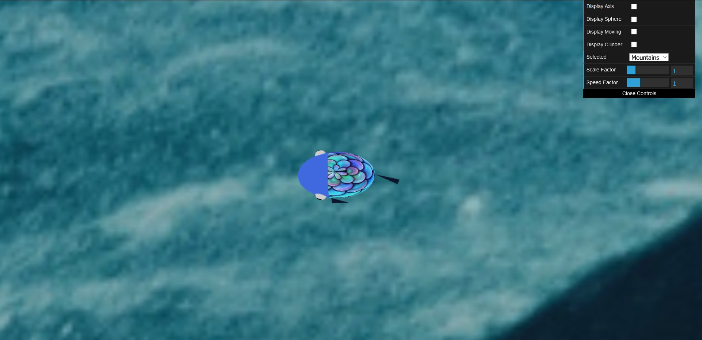
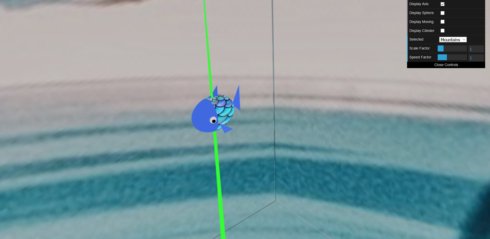

### 2 - Fundo de areia com “ninho”

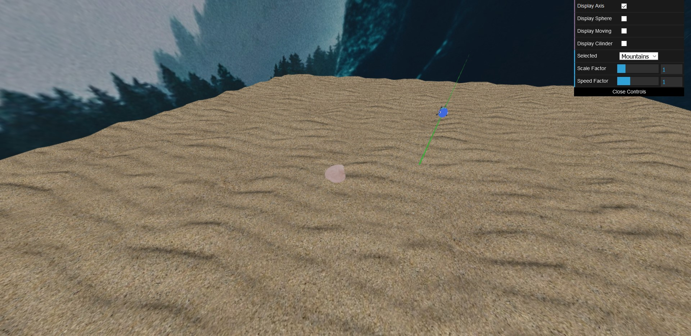

### 3 - Superfície da água

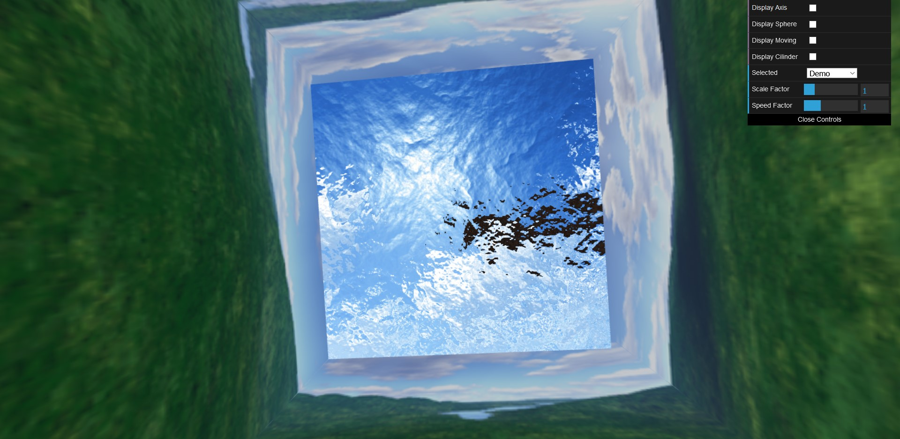

### 4 - Pedras

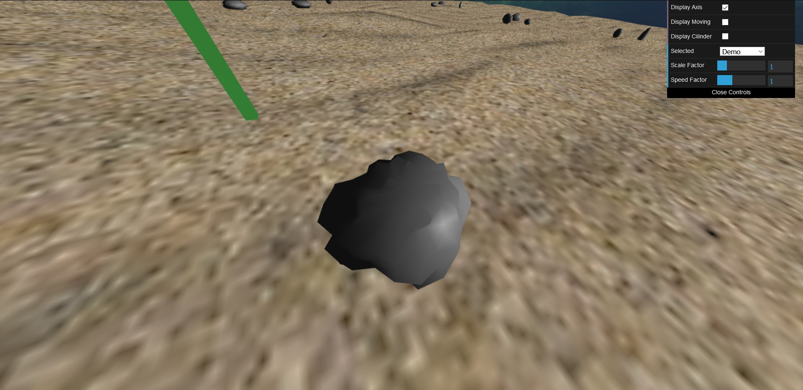
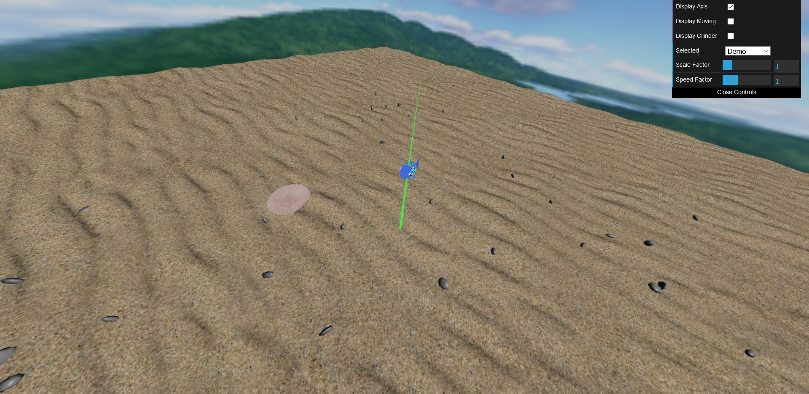

### 5 - Pilares

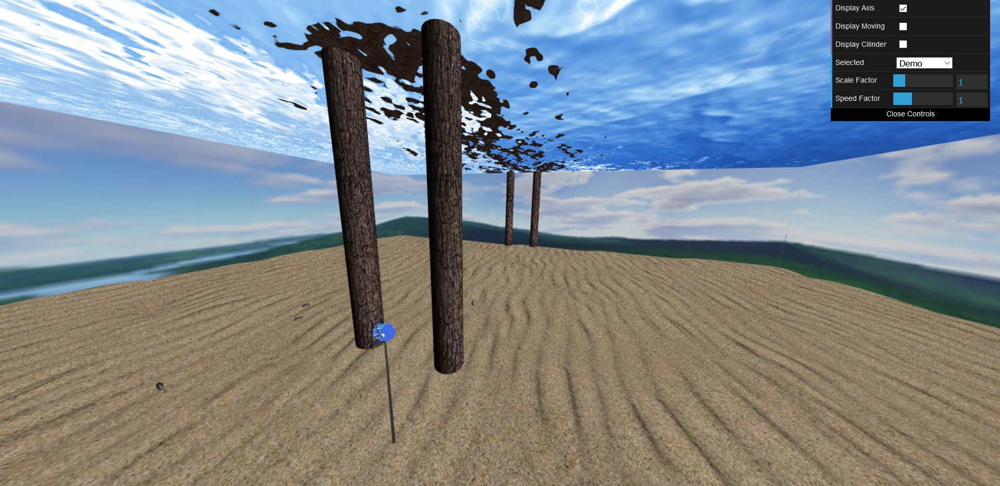

### 6 - Panorâmica geral

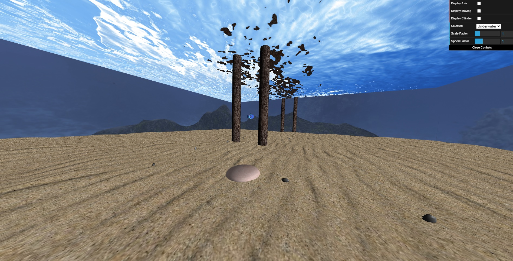

### 7 - Recolha de pedras

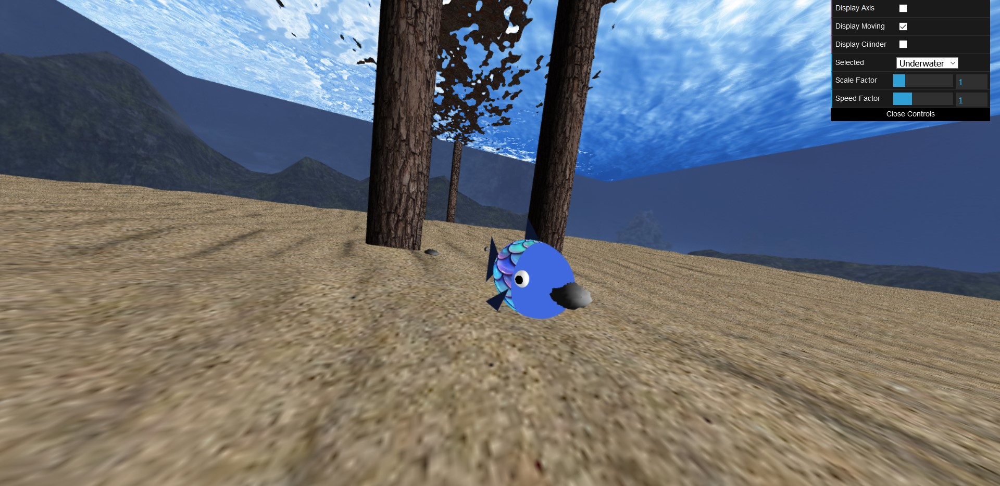
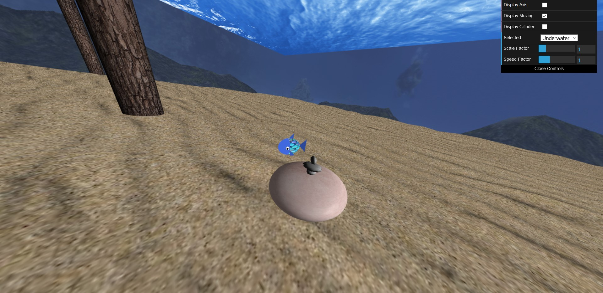

### 8a - Algas

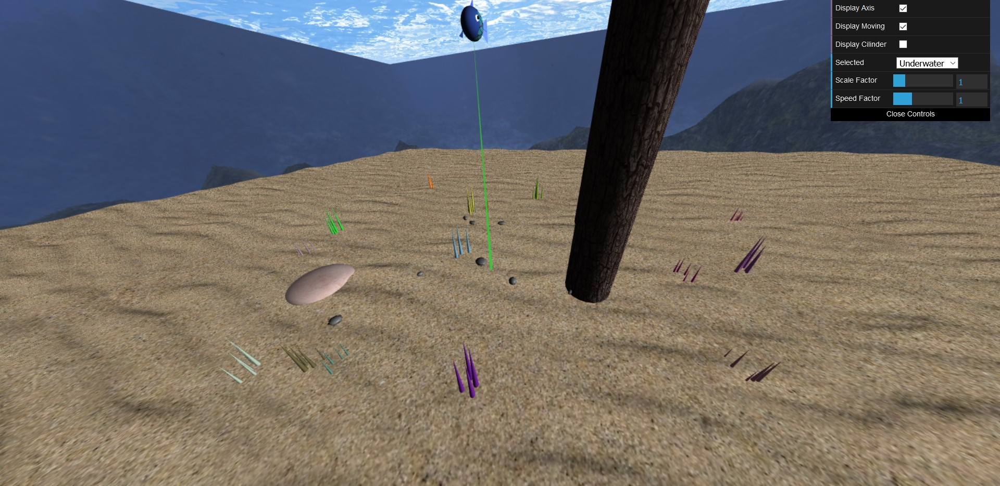

### 8b - Colocação das pedras no alvo

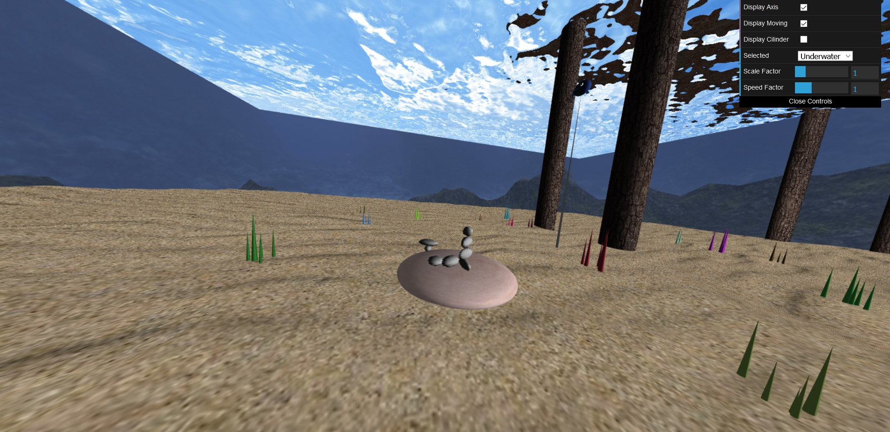

### 8c - Lançamento das pedras para o alvo

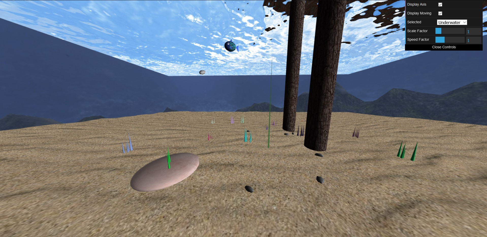

### 8d - Shader do peixe melhorado

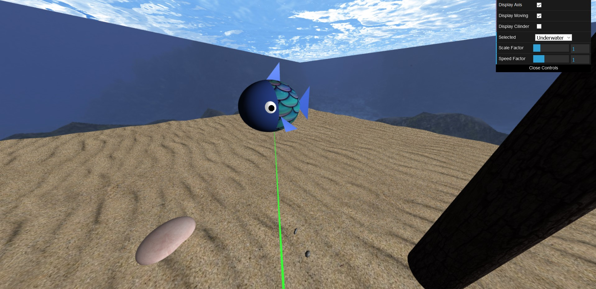
